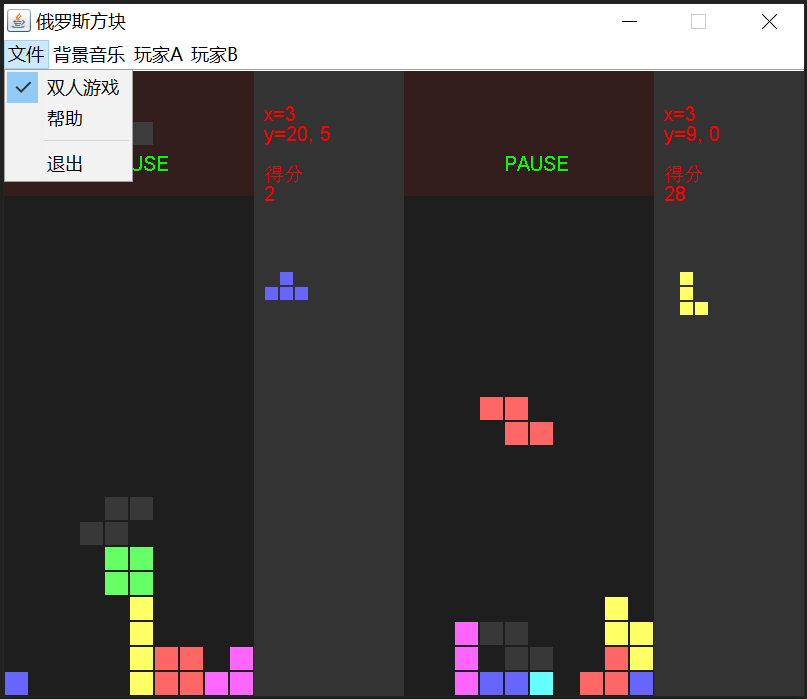

# tetris
java gui project

## 游戏界面

## 背景音乐

* 小星星

## ChangeLog

* 1010 增加背景音乐
* 0928 游戏能够正常结束
* 0927 记录消去行数
* 0926 增加彩色方块; 下一个方块提示

## TODO

* 没有逆时针旋转
* 没有实现计分，关卡
* 旋转碰撞检测仍有问题
* 没有游戏规则说明
* 没有构建说明
* 没有音效
* 代码缺少注释和文档说明
* 方块生成规则太简单

